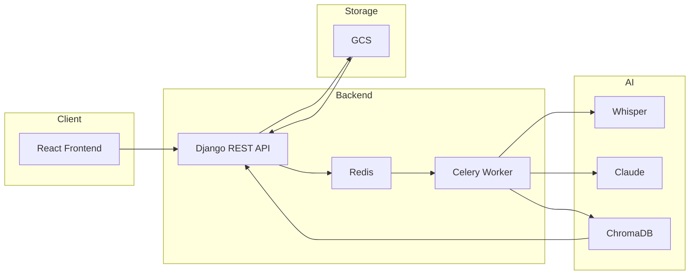

<div align="center">
  <h1>🎙️ TranslateeIQ</h1>
  <p><strong>Turn meeting recordings into searchable transcripts, AI summaries, and actionable minutes — then chat with your meetings.</strong></p>

  <a href="https://github.com/ANUJOMER21/translateeIQ/stargazers">
    
  </a>
  <a href="https://github.com/ANUJOMER21/translateeIQ/issues">
    
  </a>
  <a href="https://github.com/ANUJOMER21/translateeIQ/blob/main/LICENSE">
    
  </a>

<br><br>

  
  
  
  

<br><br>

  <strong>
    <a href="https://meeting-frontend-pn4443kooa-uc.a.run.app">🌐 Live Demo</a> •
    <a href="https://github.com/ANUJOMER21/translateeIQ/issues">🐛 Report Bug</a> •
    <a href="https://github.com/ANUJOMER21/translateeIQ/issues/new?template=feature_request.md">💡 Request Feature</a>
  </strong>
</div>

---

## ✨ Features

* 🎬 Chunked Upload (5MB chunks)
* 🎤 Whisper-based transcription
* 📝 Claude-powered structured transcripts
* 📋 AI summaries & meeting minutes
* 🔍 Semantic search (ChromaDB)
* 💬 Chat with meetings (RAG)
* 🔗 Public sharing links
* 📄 PDF export
* 📊 Dashboard insights
* ✅ Action tracking

---

## 🛠️ Tech Stack

| Layer     | Technology                        |
| --------- | --------------------------------- |
| Frontend  | React 18, Vite, Tailwind, Zustand |
| Backend   | Django + DRF                      |
| Async     | Celery + Redis                    |
| AI        | Whisper + Claude                  |
| Vector DB | ChromaDB                          |
| Storage   | Google Cloud Storage              |

---

## 🚀 Quick Start

### 1. Clone

```bash
git clone https://github.com/ANUJOMER21/translateeIQ.git
cd translateeIQ
```

### 2. Frontend

```bash
cd frontend
npm install
npm run dev
```

### 3. Backend

```bash
cd backend
python -m venv venv
source venv/bin/activate   # Windows: venv\Scripts\activate

pip install -r requirements.txt

cp .env.example .env
python manage.py migrate
python manage.py runserver
```

### 4. Services

```bash
redis-server
celery -A config.celery_app worker -l info
```

👉 Open: http://localhost:5173

---

## 📊 Architecture



---

## ☁️ Deployment

Deployed on Google Cloud Run
Scripts available in `/deploy`

---

## 📁 Project Structure

```bash
translateeIQ/
├── frontend/
├── backend/
│   ├── apps/
│   └── config/
├── deploy/
└── LICENSE
```

---

## 📄 License

MIT License

---

## 🙏 Credits

* OpenAI Whisper
* Anthropic Claude
* ChromaDB

---

⭐ Star this repo if you found it useful!
